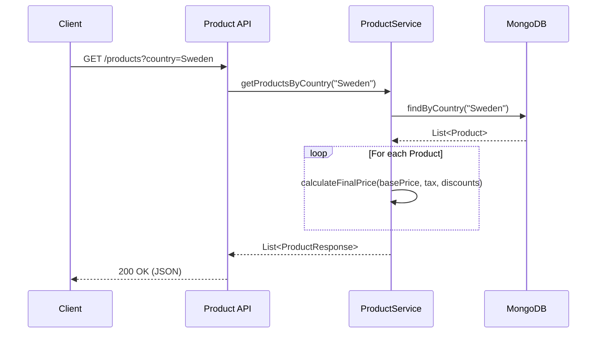
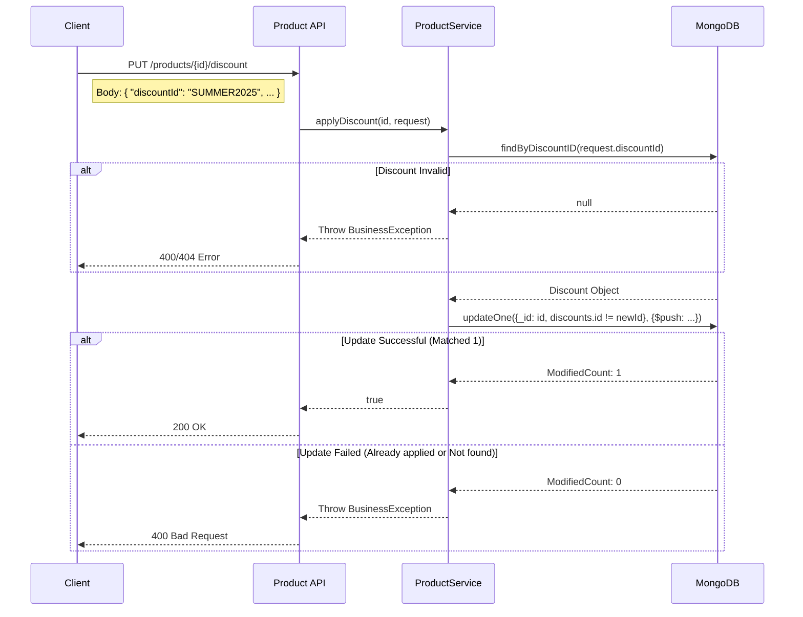

# Architecture Documentation

## Design Overview
The application follows a simplified Clean Architecture approach, structured into:
- **Routes (Controller)**: Handles HTTP requests and responses.
- **Service Layer**: Contains business logic (VAT calculation, discount logic).
- **Repository Layer**: Manages data persistence with MongoDB.

Dependencies are injected manually (or via Ktor's module structure) to keep the application lightweight.

## Concurrency Approach
To handle concurrent requests for applying discounts (e.g., ensuring a discount is applied exactly once per product), we utilize **MongoDB's atomic updates** and **Optimistic Locking** principles.

Specifically, the `addDiscount` method in `ProductRepository` uses a conditional update:
```kotlin
val filter = Filters.and(
    Filters.eq("_id", productId),
    Filters.ne("discounts.discountId", discount.discountId) // Condition: Discount ID must not exist
)
val update = Updates.push("discounts", discount)
val result = collection.updateOne(filter, update)
```
- **Atomicity**: `updateOne` is atomic at the document level.
- **Idempotency**: The filter `Filters.ne("discounts.discountId", discount.discountId)` ensures that if the discount ID is already present in the `discounts` array, the update matches 0 documents and performs no action.
- **Thread Safety**: This pushes the concurrency control to the database engine, avoiding the need for synchronized blocks or complex in-memory locks within the application service instances.

## Sequence Diagrams

### GET /products
Retrieves products for a specific country with calculated final prices.



### PUT /products/{id}/discount
Applies a discount to a product.


